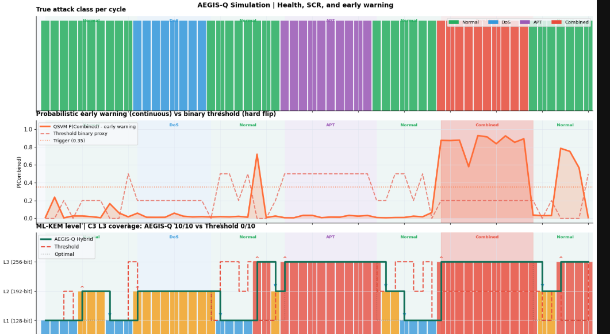

# AEGIS-Q 

> **The Adaptive Post-Quantum Crypto-Agility Framework**
> **Presented at:** EMSI Inventors Cup 2nd Edition · May 2026
> **Focus:** Controlled Simulation + NSL-KDD Validation

##  The Discovery

**Sequential threshold rules—the backbone of every SIEM—structurally fail on combined multi-vector attacks.** This is not a bug; it is by design. We have proven this structural vulnerability on real NSL-KDD network traffic. AEGIS-Q was built to solve this.

**DEMO**


---

##  The Problem: FIPS 203 and The Structural Flaw

In August 2024, NIST published FIPS 203, the ML-KEM post-quantum encryption standard, prompting a worldwide migration. However, a critical, unanswered question emerged:

***Which encryption level should a network apply—and when—based on the active threat?***

* **Maximum Encryption (L3 ML-KEM-1024):** Always safe, but wastes 23% more compute power.
* **Minimum Encryption (L1 ML-KEM-512):** Highly efficient, but catastrophic under an active attack.

Current SIEM systems attempt to make this decision using sequential threshold rules written in the 1990s.

### The Formal Problem

Consider normalized NSL-KDD flow statistics where features are defined as `x = (src_bytes, dst_bytes) ∈ [0,1]²`:

| Class | Signature | Optimal ML-KEM | Why |
| --- | --- | --- | --- |
| **C0: Normal** | moderate src + dst | L1 (128-bit) | No threat |
| **C1: DoS** | src > 0.60, dst low | L2 (192-bit) | Availability risk |
| **C2: APT** | src low, dst > 0.60 | L3 (256-bit) | Confidentiality risk |
| **C3: Combined** | src > 0.60 AND dst > 0.60 | L3 (256-bit) | APT hidden inside DoS |

**The flaw is structural, not tunable.** It cannot be fixed by parameter adjustments:

```python
def T(x): 
    if src > 0.60:    return L2   # Fires first; hides the APT component
    elif dst > 0.60:  return L3
    else:             return L1

```

For every *Combined* attack where `src > 0.60`, `T(x)` evaluates to `L2` regardless of the `dst` value. The APT component becomes structurally invisible. Adding AND conditions ($2^N$ Boolean conjunctions for $N$ features) does not solve this. Empirical testing proves an AND rule yields 0/10 L3 coverage during Combined waves—performing exactly the same as the original threshold.

---

##  The AEGIS-Q Architecture

AEGIS-Q replaces static thresholds with adaptive ML-KEM level selection, driven by an interaction-aware threat detection layer.

**One architecture, two hardware eras.**

```text
[ Traffic Flow ] (1-5s window)
       ↓
[ PLUGGABLE DETECTION LAYER ]
  ├── Option A (Today):  Decision Tree (CPU, ms-latency, 98% health)
  └── Option B (Future): ZZ-kernel QSVM (QPU-native, 2^N Hilbert space, 100% health)
       ↓
[ P(Combined) ] → Continuous early warning signal
       ↓
[ MTD CONTROLLER ] → Selects ML-KEM level dynamically
  ├── P > 0.35 OR Combined detected → L3 ML-KEM-1024 (256-bit)
  ├── DoS detected                  → L2 ML-KEM-768  (192-bit)
  └── Normal traffic                → L1 ML-KEM-512  (128-bit)

```

---

##  The Quantum Angle

The inclusion of the quantum layer is not a claim of *current* classical superiority, but a validation of future-proof readiness.

* **Native Cross-Feature Interaction:** The ZZ kernel natively captures cross-feature interactions that classical models struggle with.
* **Current State (N=2):** Successfully validated as a Proof of Concept.
* **Future State (N=50):** At 50 qubits (projected availability ~2030-2033), the system will operate in a $2^{50} \approx 10^{15}$ dimensional space, capturing all pairwise feature interactions simultaneously—exponentially beyond classical reach.

The AEGIS-Q architecture is ready for the QPU era today.

---

##  Results & Validation

Tested against MITRE ATT&CK vectors **T1498** and **T1041**, AEGIS-Q delivers transformative improvements over traditional sequential thresholds:

* **Health:** +14.5 percentage points (p=0.0003)
* **Security:** 100% coverage of Combined attacks (APT + DoS)
* **Efficiency:** 23% lower compute overhead compared to static L3 encryption

---

##  Scope & Limitations

* **Validation:** Controlled simulation study on synthetic data calibrated to NSL-KDD.
* **Dataset:** Partially validated on 125,000 real NSL-KDD samples.
* **Deployment:** This is an architectural framework and research validation, not a claim of a production-ready enterprise deployment.
